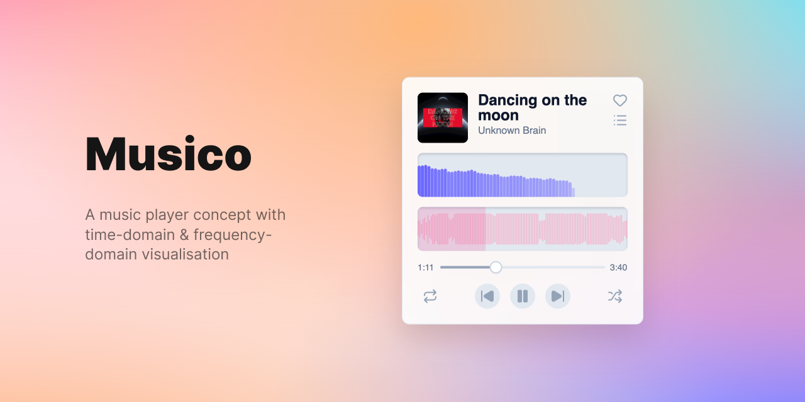

# Musico

_A music player concept for audio analysation on the web_

## Objective

The goal of this project to test the limits of current browser abilities in terms of audio analysation. The audio part so far has been completely built from scratch with just the Web Audio API. The visualisation is built on Canvas API. So it has been tested on Blink based browsers (Edge, Chrome etc.) and Safari. Firefox testing yet to do.

### Features so far

- Full time-domain & real-time frequency-domain visualisation
- Music player with play next/prev, skip forward/backward, shuffle, repeat features

### Few Possibilities

- [ ] Build equaliser
- [ ] Allow visualisation from user files and/or provided direct file links
- [ ] Drum pad
- [ ] Lo-fi mix tape
- [ ] Experiment with applying filters on streamed audio
- [ ] Experiment with going completely off the CPU (and Web Audio API obviously) with webGPU. With compute shaders it is possible in theory but I will have to see

## Built with

- Web Music API
- React
- Vite
- Tailwind CSS
- Framer Motion
